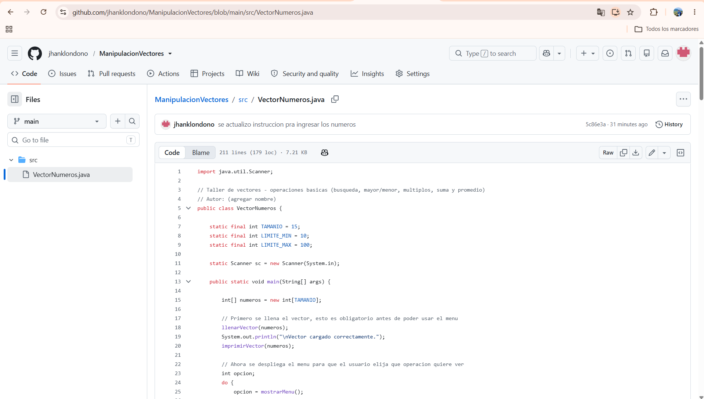

# Taller de Vectores en Java

Actividad práctica sobre manejo de vectores (arreglos) en Java: búsqueda de valores, determinación de máximos y mínimos, identificación de múltiplos, cálculo de suma/promedio y generación de un nuevo vector a partir de una condición.

## Estructura del proyecto

```
ManipulacionVectores/
└── src/
    ├── imagenes/
    │   ├── captura 1 commit.png
    │   ├── codigo.png
    │   ├── github.png
    │   ├── ingreso numeros.png
    │   └── menu.png
    ├── README.md
    └── VectorNumeros.java
```

El proyecto tiene una sola clase, `VectorNumeros`, con un método `main` que llama a un menú y una serie de métodos separados, uno por cada operación pedida en la actividad.

## Qué hace el programa

1. **Llenado del vector**: pide 15 números enteros al usuario. Si un número está fuera del rango 10-100, avisa y vuelve a pedir el mismo dato sin avanzar de posición, hasta llenar las 15 posiciones.
2. **Menú interactivo**: una vez lleno el vector, muestra un menú en consola con las siguientes opciones, repetible mientras el usuario no elija salir:

```
===== MENU =====
1. Mostrar el vector
2. Buscar un numero en el vector
3. Mostrar el mayor y el menor valor
4. Buscar multiplos de un numero X
5. Calcular la suma total
6. Generar vector con numeros sobre el promedio
0. Salir
```

- **Opción 1**: imprime el vector cargado.
- **Opción 2**: pide un número y busca su posición en el vector con un ciclo `for`; si no está, avisa que no se encontró.
- **Opción 3**: recorre el vector una sola vez y determina el valor mayor y el menor.
- **Opción 4**: pide un número X (distinto de cero) y muestra todos los elementos del vector que son múltiplos de X, junto con su posición; si no hay ninguno, lo indica.
- **Opción 5**: suma todos los elementos del vector con un acumulador y muestra el total.
- **Opción 6**: calcula el promedio del vector, arma un nuevo vector solo con los valores por encima de ese promedio, lo imprime e indica cuántos números lo componen; si ninguno supera el promedio, lo indica en consola.

## Métodos del programa

| Método | Qué hace |
|---|---|
| `llenarVector(int[] numeros)` | Solicita y valida los 15 números (rango 10-100) |
| `mostrarMenu()` | Imprime las opciones y devuelve la elección del usuario |
| `buscarNumero(int[] numeros)` | Busca un valor y muestra su posición o informa que no existe |
| `mostrarMayorYMenor(int[] numeros)` | Determina el mayor y el menor valor del vector |
| `buscarMultiplos(int[] numeros)` | Muestra los múltiplos de un número X ingresado por el usuario |
| `sumarVector(int[] numeros)` | Devuelve la suma total de los elementos |
| `generarVectorSobrePromedio(int[] numeros, int suma)` | Calcula el promedio y arma el vector de valores por encima de él |
| `imprimirVector(int[] v)` | Imprime cualquier vector recibido como parámetro |

## Requisitos para ejecutar

- JDK 17 o superior (desarrollado y probado con Eclipse Temurin)
- Visual Studio Code (con o sin la extensión de Java; el programa también corre por terminal sin ella)

## Cómo compilar y ejecutar

Desde la raíz del proyecto:

```bash
cd src
javac VectorNumeros.java
java VectorNumeros
```

## Objetivo de la actividad

Practicar operaciones fundamentales con vectores en Java: recorrido con ciclos, búsqueda lineal, comparación para hallar máximos y mínimos, uso del operador módulo para identificar múltiplos, acumuladores para sumas, y creación de nuevos vectores a partir de condiciones sobre los datos originales.




## Enlace al video
https://youtu.be/RoaoBxLxEOY?si=n34lOmAzAtFMDJZX
